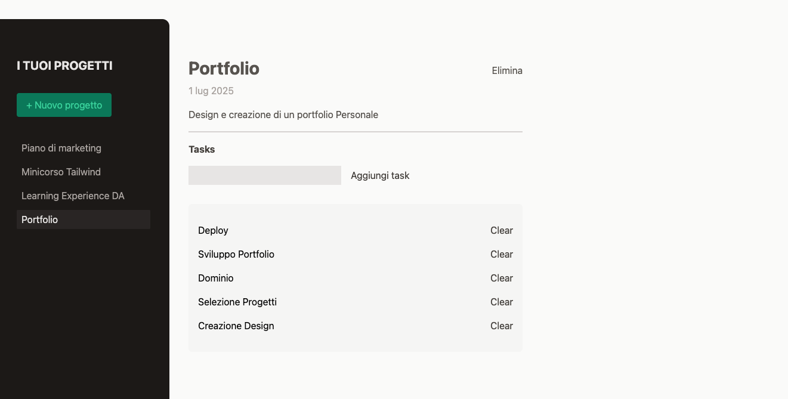

# Project Manager 🗂️

**Project Manager** è un’applicazione React per gestire progetti e le relative task.  
L’utente può creare ed eliminare progetti, e per ciascun progetto gestire un elenco di task in modo semplice e veloce.



## Tecnologie utilizzate

- React
- Tailwind CSS (per la completa gestione dello stile)
- useState (per la gestione dello stato)
- useRef (per tracciare riferimenti senza forzare re-render)
- React Portal (per un rendering più flessibile dei componenti)
- useReducer (gestione task e progetti)
- React Context API (per condividere in modo centralizzato lo stato dei progetti tra i componenti senza prop drilling)
- localStorage (persistenza client-side, in modo da mantenere i dati tra i refresh della pagina)

## Installazione

Per eseguire il progetto in locale:

```bash
git clone https://github.com/leonardoLoddo/project-manager
cd project-manager
npm install
npm run dev
```

## Autore

Leonardo Loddo - Web Dev e Docente di sviluppo
